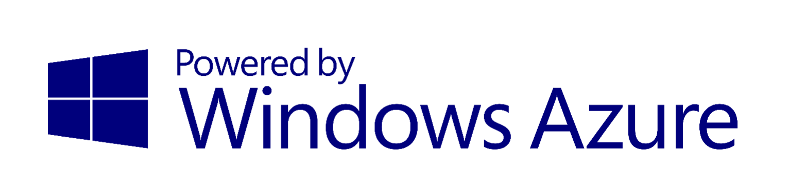

# HackIllinois_GamerTagDB
A gamertag database written in ASP.net using C#.  Can be used at gaming events (ie LAN) to easily share gamer-tags with others so you can find others who are playing similar titles as you on a similar platform.

##Short Description
The ACM Gamertag Database application is a web application that will allow members to store their GamerTag ID’s from a variety of gaming services in one central location online. 

##Insertion
The application will allow a user to submit the following data: 
User’s Real Name, 
Gaming Services and corresponding GamerTag ID’s
Optional section for Games. 

This information will be placed within a GridView and each column may be sorted alphabetically.

##Handling Tag Removal
The application will allow a user to remove entries in three ways: 
Session Based - Upon submitting a tag, the application starts a session to allow a user to remove their own tag while it is still active. 
###Key Based
The user may optionally provide a deletion key if they would like to remove their ID after a session has expired. 

###Admin Based
There is a secret admin panel hyperlinked that allows manually removing a given name if the admin password is provided.

<b>Notice:</b> For any of these methods to execute correctly you must click each button, simply hitting enter may not work. 

 
